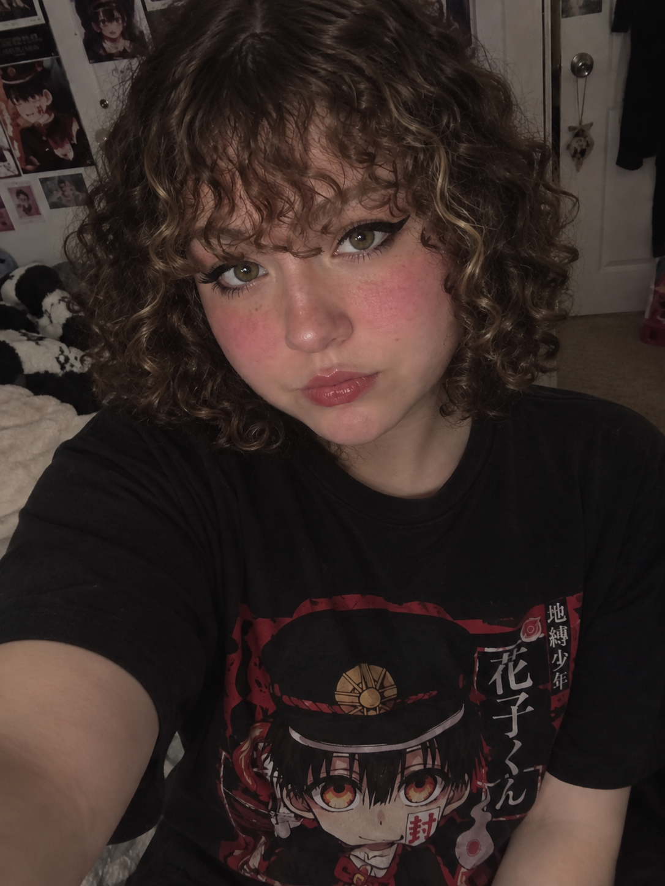
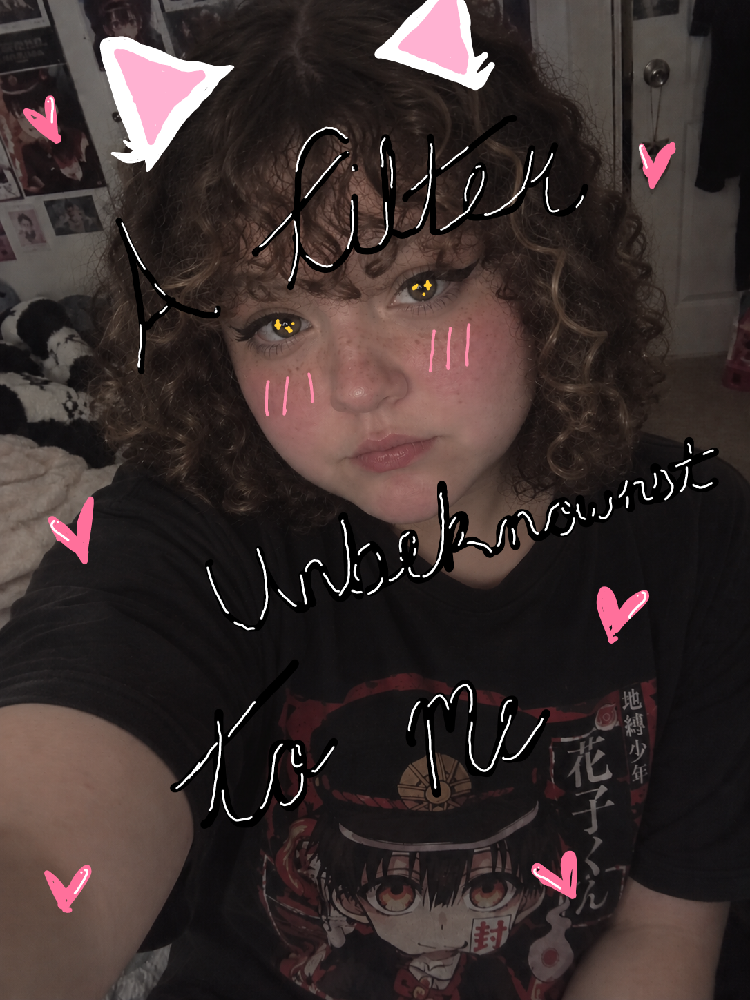

# Make 2: Selfie & Identity

## The Artifact

### Original Selfie (ChatSelfie)

### Edited Selfie (ChatSelfie Edited - "A filter unbeknownst to me")

## Process Notes
How did you make this?
What tools did you use?
What decisions did you make?

## Reflection
Respond to this week’s reflection prompt in 200–300 words.

## Attribution & AI Use
- Tools used:
- AI prompts (summary):
- What AI generated:
- What you changed or decided:

