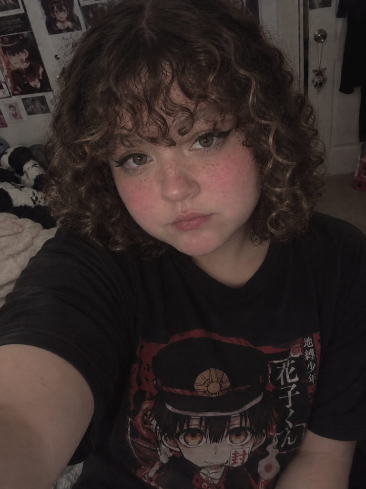

# Week 3 – Selfie & Identity

## The Artifact

### Original Selfie (ChatSelfie)

### Edited Selfie (ChatSelfie Edited - "A filter unbeknownst to me")

## Process Notes
How did you make this? 

I made these images through inputing a series of detailed prompts to ChatGPTs interface. I put in an intial description and then tweaked and added more description based on what image the AI returned to me. I did this until I was relatively happy with the image. Then to create my tampered with image I took the image the AI gave me and put it into IBIS paint X and drew on top of it until I was happy with the results.

What tools did you use?

For this project I utilized ChatGPT's image creation and IBIS Paint X. 

What decisions did you make?

I decided what prompts to give the AI. Then after I had an image I was pleased with I decided to add some more filteresque features to the image to really accentuate how filtered it already felt. I decided to add text "A filter Unbknownst to Me" to add to the theme I was already sensing. 

## Reflection
The creation of a selfie resembling me through ai was an interesting process to say the least. I chose to go the route of simply describing myself to ChatGPT rather than uploading an image I already had. As you can see the initial image it gave me is very different from what I ended up happy with. An interesting note that even though in my initial prompt I told it my face was on the chubbier/rounder end it still decided to make the body in the image seen as skinny. Something I adjusted in my further prompts but it still did not add much to my body. I have to say the only place I completely see myself in the image the ai created is the hair. That is actually pretty accurate to what my hair actually looks like. The placement of my rosacea is also fairly accurate but in the image it looks more like makeup I added rather than a natural change in pigment in my skin tone like I have. The anime tshirt is also fairly accurate to something that I would actually wear. But I did prompt the AI to do that, so I am curious what kind of clothing it would have put me in if I didn’t tell it what to do.
Everything else is where I don’t see myself. The face just looks uncanny. It looks like a soft porcelain doll more than an actual human. The facial features are not accentuated. And even though I adjusted that my lips were not as big as it made them in the initial image, it still did not shrink them very much when I made that edit. The ai created a filtered version of a human without showing the true complexities of what I truly look like. This is really problematic because the AI created/changed things about me when I was fairly explicit in what I wanted. These attribute changes can create insecurities that people didn’t even previously have because of what is expected of them.

## Attribution & AI Use

- AI prompts (summary):

Initial Prompt to Create: a selfie for me of a white girl. Her hair is brown with a little blonde mixed in and its curly and chin length. Curl type 3b. Her hair is a little flat near the scalp though. She has bangs that are down to her eybrows, the bangs are also curly. Her eyebrows are also slighlty lighter than the rest of her hair. Her eyes are hazel, hooded, and double lidded, and she usually wears winged black eyeliner.Her face is a little round and chubby and her cheeks are usually pretty red. She is also usually in a toilet-bound hanako kun shirt

Edits made to get second image: She's a little chubbier than that and her lips are smaller. She has light freckling on her nose and cheeks. Her lips aren't that big. Her eyes have an extra bottom crease. And her nose is more button shaped. Her eyebrows also aren't that defined and the extra lower lid crease is not that defined.

