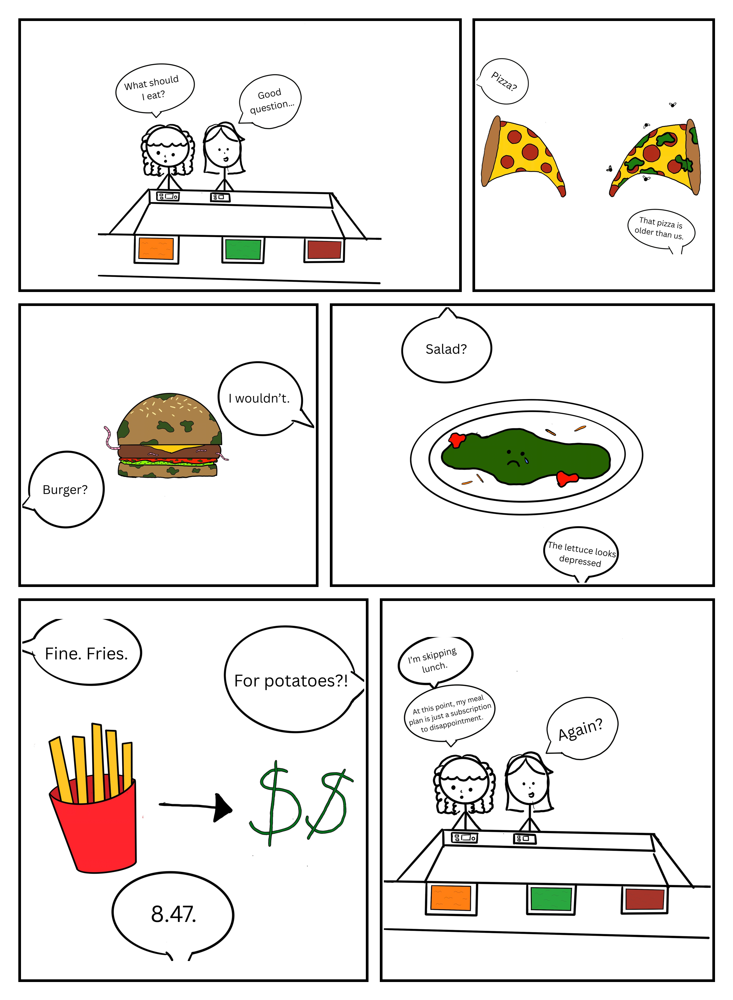

# Week 4 – Comic & Storytelling

## The Artifact
A comic depicting th estruggles that come with trying to find good food when you are a college student. 

### What's for Lunch?

## Process Notes
How did you make this? 

I made this by asking ChatGPT to generate a dialogue draft for a 6 panel comic about struggling to find lunch options at school. I then went to procreate and drew a panel for each piece of dialogue and then put the images into canva to input the dialogue onto each image. I then had ChatGPT format my images into a comic book format. 

What tools did you use?

I utilized ChatGPT, Procreate, and Canva to make the final product. 

What decisions did you make?

I decided what I wanted the final dialogue draft to look like, what I wanted the final images to look like, and I helped the AI into formatting the images into a comic book arrangement I liked. 

## Reflection
In this comic, I wanted to make light of a situation that many college students face. The struggle with dining and the quality of food options on campus. I had a concept in mind and knew that I wanted the final product to be humorous, but I could not come up with dialogue on my own. So, I used ChatGPT to help me come up with dialogue drafts. I went through a few drafts before I finally settled on one I was pleased with. But I did decide to take the line for panel six from a previous draft the AI had created. Looking back, I think I could have played around with the dialogue drafts a little more because, although slightly funny, I do find the humor to be rather surface-level. Also, after showing the draft to some friends, they said it was evident that the drafts were AI-generated. I think I could have put in some more human intervention to tweak the dialogue to seem less robotic.

Tying into this is the reason I decided to draw the art of the comic myself. I trusted myself to know what I wanted specifically for the art of each panel more than I trusted the AI to know what to do. I had an image in my mind for each panel as soon as I read the final AI draft, I was happy with so that's why I thought it best to do it myself. AI may have been able to produce overall prettier images, but I liked the aspect of control I had with doing it myself instead. 

I also had AI format the images into the comic book format, which took human intervention, as I had to explain to it that I wanted varied panel sizes and what order the images were supposed to be in. And even with the intervention I was giving it, the AI still did not seem to want to format things the way I envisoned as it didn’t really properly crop the images to their panel sizes. I think if I did the formatting myself, the overall final quality of the product would have been better, but I wasn’t sure how I wanted everything formatted, and that is why I decided to use the AI. 

## Attribution & AI Use
- AI Tool: ChatGPT (Dialogue Draft and formatting images into a comic book format)
Human Contribution: Main Story Premise, Editing and compiling of drafts to make the final version, used Procreate to illustrate each panel by hand, and used Canva to put the dialogue text onto each image
AI Role: Assists in accessibility and convenience of creation 

- AI prompts (summary): "Create a dialogue draft for a 6 panel comic for me about bad dining options on campus, make it funny" and "Im going to send you six images, I want you to compile them into a comic book format" 
- What AI generated: See Above 
- What you changed or decided: I compiled the different dialogue drafts I was given to create a final dialogue I was pleased with. I also decided what images I wanted each panel to depcict and how I wanted the panels to be formatted. 
