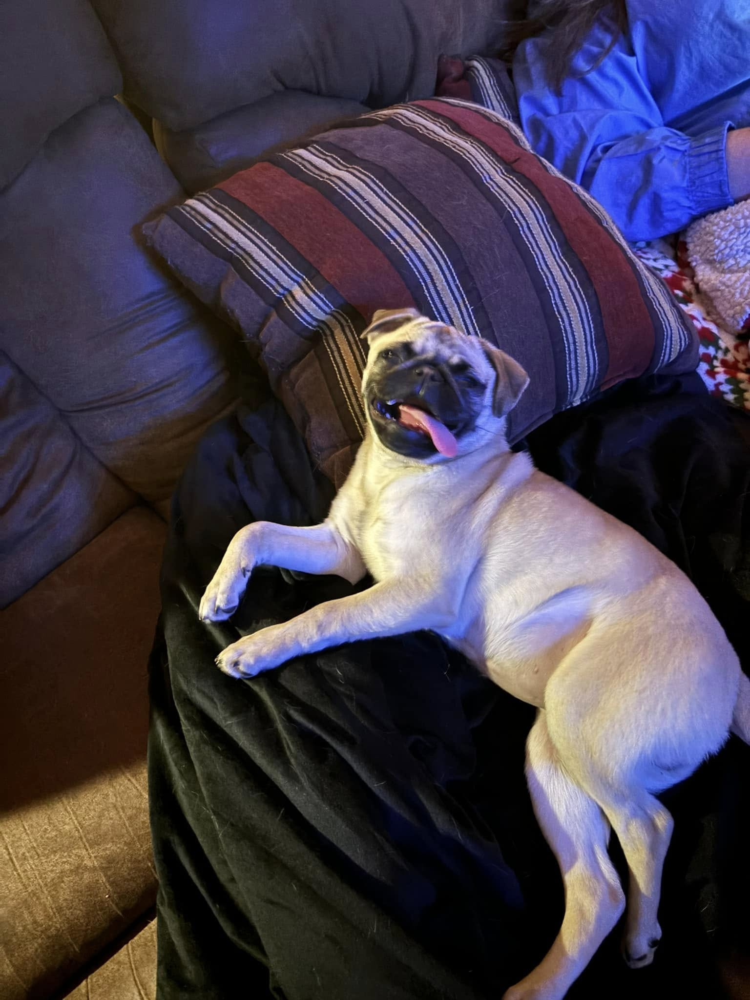

# Angel Baby's Corner 🐾💖

Meet **Angel Baby**, the sweetest, goofiest pug in the world and the official mascot of my college career at Denison University!

## Meet Miss Angel 🐶
* **Breed**: Pug
* **Title**: Chief Morale & Snack Officer
* **Signature Move**: Upside-down nap & tongue blep
* **Favorite Place**: Wherever the warmest cushion or blanket happens to be
* **Favorite Treats**: Peanut butter biscuits, pup cups, and anything you're eating

## The Story of Angel Baby
Angel Baby has been my loyal companion through long study sessions, late-night reading assignments, and creative projects. When she isn't supervising my work with sleepy half-closed eyes, she's demanding ear scratches or performing her victory dance when dinner is served.

> *"A pug a day keeps the stress away."* ✨🐾

## Want to see more?
Head back to the [Home Page](../index.html#angel) to see Angel's interactive photo gallery, or check out my [DH101 Coursework](../index.html#coursework)!

